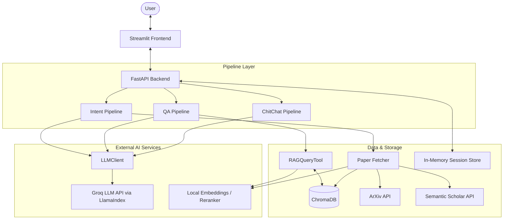

# RAG Research Agent — Project Documentation

This document is the single source of truth for the project's system design, component architecture, data flows, deployment strategy, and architectural decisions.

---

## Table of Contents

1. [Project Structure](#1-project-structure)
2. [High-Level Architecture](#2-high-level-architecture)
3. [Component Details](#3-component-details)
4. [Data Flow](#4-data-flow)
5. [Deployment & Infrastructure](#5-deployment--infrastructure)
6. [Scaling Considerations](#6-scaling-considerations)
7. [Architectural Decisions & Critical Analysis](#7-architectural-decisions--critical-analysis)
8. [Known Gaps & Future Work](#8-known-gaps--future-work)

---

## 1. Project Structure

```
rag-res-agent/
├── src/
│   ├── agents_src/
│   │   ├── config/
│   │   │   └── agent_settings.py       # Centralised settings (env-backed via pydantic-settings)
│   │   ├── llm/
│   │   │   ├── client.py               # LLMClient singleton + LLM_CONFIG (model names/temps)
│   │   │   └── models.py               # Shared embed + rerank model singletons
│   │   ├── pipeline/
│   │   │   ├── intent.py               # IntentPipeline — classifies query intent
│   │   │   ├── qa.py                   # QAPipeline — RAG-based answer generation
│   │   │   └── chitchat.py             # ChitChatPipeline — conversational responses
│   │   ├── schemas.py                  # Shared Pydantic models (IntentOutput, AnswerStructure)
│   │   ├── tools/
│   │   │   └── rag_qa_tool.py          # RAGQueryTool singleton — retrieval + rerank + synthesis
│   │   └── utils/
│   │       └── paper_fetcher.py        # Two-phase paper fetch + MMR ranking + ingest
│   ├── backend_src/
│   │   ├── api/                        # FastAPI route handlers
│   │   ├── memory/
│   │   │   └── session_store.py        # In-memory session store + rolling summary
│   │   ├── services/
│   │   │   └── chat.py                 # Request orchestrator — the main pipeline entry point
│   │   └── main.py
│   └── frontend_src/
│       └── app.py                      # Streamlit UI
├── scripts/
│   └── seed_vectorstore.py             # One-time script to pre-seed vector store from local docs
├── tests/
├── data/                               # Runtime data (gitignored, mounted as volume)
│   ├── docs/                           # Downloaded PDFs
│   └── vector_store/                   # ChromaDB persistent storage
├── docker-compose.yml
├── Dockerfile
├── start.sh
├── .env.example
├── requirements.txt
├── docs.md                             # This file
└── DISCUSSION.md                       # Collaborative planning notes
```

**Key conventions:**
- `data/` is gitignored and should be bind-mounted in Docker so it persists across restarts.
- `scripts/seed_vectorstore.py` is run manually (or optionally on startup via `start.sh`) to load a static document corpus before first use.
- All tunable RAG constants live in `AgentSettings` — never hardcoded in tools/utils.
- All LLM model names and temperatures live in `LLM_CONFIG` inside `llm/client.py` — never hardcoded in pipeline code.

---

## 2. High-Level Architecture

The system follows a **Modular Monolith** architecture wrapped in a containerized environment. The pipeline layer (intent → fetch → answer) runs as plain Python classes with no agent framework overhead. All singletons (LLM client, RAG tool, embed/rerank models) are initialised once at startup and reused across requests.

### System Context Diagram



---

## 3. Component Details

### A. Frontend Layer
- **Technology**: Streamlit
- **Location**: `src/frontend_src/app.py`
- **Role**:
  - Renders the Chat UI.
  - Manages explicit `session_id` generation (UUID).
  - Displays markdown responses and source citations.
  - **Stateless**: all conversation history managed by the backend.

### B. Backend API Layer (FastAPI)
- **Technology**: FastAPI
- **Location**: `src/backend_src/api/chat.py` & `src/backend_src/services/chat.py`
- **Role**:
  - Exposes `POST /chat/answer` endpoint.
  - **Orchestrator** (`services/chat.py`): Receives query → updates memory → runs IntentPipeline → optional paper fetch → routes to QAPipeline or ChitChatPipeline → updates summary → returns response.
- **State Management**:
  - `src/backend_src/memory/session_store.py` holds a `sessions` dict in RAM.
  - Session memory is lost on process restart (not persisted to disk).

### C. Pipeline Layer

The pipeline layer replaces the previous CrewAI agent/task/crew abstraction. Each pipeline is a plain Python class with a single `run()` method. All pipelines are module-level singletons instantiated once in `services/chat.py`.

| Pipeline | Model | LLM Calls | Role |
| :--- | :--- | :--- | :--- |
| `IntentPipeline` | gpt-4o-mini (temp 0.0) | 1 (JSON mode) | Classifies query → `IntentOutput` |
| `QAPipeline` | — | 0 | Calls RAGQueryTool, builds response in Python |
| `ChitChatPipeline` | gpt-4o-mini (temp 0.7) | 1 | Handles greetings, small talk, fetch confirmations |

**RAGQueryTool synthesis**: gpt-4o (temp 0.0) via `LLMClient` — this is the one high-quality call per RAG turn.

**LLM Client** (`llm/client.py`):
- Singleton wrapper around LlamaIndex's `OpenAI` LLM integration.
- Contains `LLM_CONFIG` dict — model names and temperatures live here, not in a separate file.
- Caches one `OpenAI` instance per agent name.
- Accepts `json_mode=True` to enforce JSON output via `response_format`.
- To swap providers: change only the import and `_get_llm()` instantiation; update model names in `LLM_CONFIG`.

**Intent Pipeline query generation rules** (`pipeline/intent.py`):
- **TITLE LOOKUP** (user asks for a specific paper by name): return the exact title as a **single query** — no expansion.
- **TOPIC SEARCH** (user asks for papers on a subject): generate **2–5 diverse queries** covering different facets.

### D. Data Ingestion & Retrieval Layer
- **Technology**: LlamaIndex, ChromaDB, OpenAI Embeddings, PyMuPDF, sentence-transformers (CrossEncoder)
- **Location**: `src/agents_src/utils/paper_fetcher.py` & `src/agents_src/tools/rag_qa_tool.py`

#### RAGQueryTool (`tools/rag_qa_tool.py`)

A singleton class. ChromaDB client, LlamaIndex index, and retriever are initialised **once** at construction time and reused across all requests. New documents ingested by `paper_fetcher` are visible immediately (shared PersistentClient path).

Query flow:
1. Vector search → top `RETRIEVAL_TOP_K` (15) chunks using `text-embedding-3-small`.
2. Cross-encoder rerank (`BAAI/bge-reranker-large`, local) → keep top `RERANK_TOP_K` (5) chunks.
3. Synthesize answer via `LLMClient` (gpt-4o) with a grounded research prompt — no hallucination.

#### Paper Fetching Pipeline (`utils/paper_fetcher.py`)

**Phase 1 — Title-specific search** (runs for every query):
- ArXiv `ti:` field search (title only, not full-text).
- Semantic Scholar API (`/graph/v1/paper/search`).
- Results split by title similarity (`SequenceMatcher` ratio ≥ 0.75) into:
  - **Confirmed matches** — known to be the right paper.
  - **Broad candidates** — potentially relevant.

**Phase 2 — Broad topic search** (for all queries × categories):
- ArXiv `all:` search across all configured categories.
- Results added to broad candidates pool.

**Ranking & Selection** (cross-encoder + MMR):
1. Cross-encoder (`BAAI/bge-reranker-large`) scores **all candidates** in one batch against the primary query.
2. Scores are min-max normalized to [0, 1].
3. Embeddings computed for all candidates (for MMR redundancy term).
4. **Confirmed matches** fill first slots by pure cross-encoder relevance.
5. **Remaining slots** filled by MMR from broad candidates:
   ```
   MMR score = λ × cross_encoder_score − (1−λ) × max_cosine_sim(candidate, already_selected)
   ```
   λ = 0.7 (configurable via `MMR_LAMBDA` constant).

**Download & Ingest**:
- Download PDFs (ArXiv direct or `openAccessPdf.url` from Semantic Scholar).
- Parse with PyMuPDF → chunk (512 tokens, 100 overlap) → embed → store in ChromaDB.

#### Centralized RAG Settings (`agent_settings.py`)

| Setting | Default | Env Var | Description |
| :--- | :--- | :--- | :--- |
| `CHUNK_SIZE` | 512 | `CHUNK_SIZE` | Tokens per chunk at ingestion |
| `CHUNK_OVERLAP` | 100 | `CHUNK_OVERLAP` | Overlap between consecutive chunks |
| `RETRIEVAL_TOP_K` | 15 | `RETRIEVAL_TOP_K` | Candidate chunks from vector search |
| `RERANK_TOP_K` | 5 | `RERANK_TOP_K` | Chunks kept after cross-encoder rerank |

---

## 4. Data Flow

### Query Flow
1. **User** types "Explain the Attention mechanism."
2. **Frontend** sends `{"user_query": "...", "session_id": "xyz"}` to Backend.
3. **SessionStore** adds user message to `chat_buffer`.
4. **Backend** (`services/chat.py`) calls **IntentPipeline** with query + history + summary.
5. **IntentPipeline** returns `IntentOutput {use_rag: true, fetch: false, request: "Explain the attention mechanism"}`.
6. **Backend** routes to **QAPipeline**.
7. **QAPipeline** calls `RAGQueryTool.query("Explain the attention mechanism")`:
   - Vector search (text-embedding-3-small) → top 15 chunks.
   - Cross-encoder rerank (BAAI/bge-reranker-large) → top 5 chunks.
   - Synthesize answer via `LLMClient` (gpt-4o).
8. **QAPipeline** returns `AnswerStructure` — this is the only LLM call in the QA path.
9. **Backend** appends answer to `chat_buffer`, updates `chat_summary`.
10. **Frontend** displays answer with sources.

### Paper Fetching Flow
1. **User** types "Fetch the 'Attention is All You Need' paper."
2. **IntentPipeline** returns `IntentOutput {fetch: true, use_rag: false, queries: ["Attention is All You Need"]}`.
3. **Backend** calls `fetch_papers_and_ingest`.
4. **Phase 1**: ArXiv `ti:` + Semantic Scholar search → confirmed match found.
5. **Phase 2**: Broad `all:` search for remaining candidates.
6. **Ranking**: Cross-encoder scores all; confirmed fills first slot; MMR selects from broad.
7. **Ingest**: PDFs downloaded → chunked → embedded → stored in ChromaDB.
8. **Backend** routes to **ChitChatPipeline** (use_rag=false), which confirms the fetch to the user.

---

## 5. Deployment & Infrastructure

### Running Locally

**Prerequisites**: copy `.env.example` to `.env` and set `GROQ_API_KEY`.

**Option A — Both services at once:**
```bash
./start.sh
```

**Option B — Separately (easier to debug):**
```bash
# Terminal 1 — Backend (add --reload for hot-reload during development)
uvicorn src.backend_src.main:app --host 0.0.0.0 --port 8000 --reload

# Terminal 2 — Frontend
streamlit run src/frontend_src/app.py --server.port 8501
```

Both commands must be run from the **project root**. Open [http://localhost:8501](http://localhost:8501).

**Startup note**: On first request, `RAGQueryTool` initialises ChromaDB + LlamaIndex and the HuggingFace models load into RAM. This takes 30–60 seconds. Subsequent requests are fast.

### Docker Structure
- **Base Image**: `python:3.11-slim`
- **Dependencies**: `build-essential` required for compiling vector/numpy libraries.
- **Ports**:
  - `8501`: Streamlit UI
  - `8000`: FastAPI backend

### Volume Management
Mount `./data` to persist runtime data across container restarts:

| What | Container Path | Host Path |
| :--- | :--- | :--- |
| ChromaDB vector store | `/app/data/vector_store` | `./data/vector_store` |
| Downloaded PDFs | `/app/data/docs` | `./data/docs` |

### Environment Variables

| Variable | Required | Default | Description |
| :--- | :--- | :--- | :--- |
| `OPENAI_API_KEY` | Yes | — | Required for all LLM calls and embeddings |
| `DOCUMENTS_DIR` | No | `/app/data/docs` | PDF storage path |
| `VECTOR_STORE_DIR` | No | `/app/data/vector_store` | ChromaDB path |
| `COLLECTION_NAME` | No | `research_papers` | ChromaDB collection name |
| `CHUNK_SIZE` | No | `512` | Tokens per chunk |
| `CHUNK_OVERLAP` | No | `100` | Token overlap between chunks |
| `RETRIEVAL_TOP_K` | No | `15` | Vector search candidate count |
| `RERANK_TOP_K` | No | `5` | Chunks kept after reranking |

### Running with Docker Compose (recommended)

```bash
cp .env.example .env
# edit .env and set GROQ_API_KEY

docker compose up --build

# Stop
docker compose down
```

### Running with Docker directly

```bash
# Build
docker build -t rag-res-agent:latest .

# Run (foreground)
docker run -p 8000:8000 -p 8501:8501 \
  -v $(pwd)/data:/app/data \
  -e GROQ_API_KEY="your_key_here" \
  rag-res-agent:latest

# Run (detached)
docker run -d -p 8000:8000 -p 8501:8501 \
  -v $(pwd)/data:/app/data \
  -e GROQ_API_KEY="your_key_here" \
  --name rag-res-agent \
  rag-res-agent:latest

# Stop / restart / remove
docker stop rag-res-agent
docker start rag-res-agent
docker rm rag-res-agent
docker rmi rag-res-agent:latest
```

### Managed vs. Self-Hosted Services

| Component | Managed Service | Self-Hosted |
| :--- | :--- | :--- |
| LLM Inference | **OpenAI API** (Cloud, via LlamaIndex) | — |
| Embeddings | **OpenAI API** — text-embedding-3-small | — |
| Reranking | — | **BAAI/bge-reranker-large** (Local, sentence-transformers) |
| Vector DB | — | **ChromaDB** (Local file-based) |
| Frontend/API | — | **Streamlit/FastAPI** (Local) |

---

## 6. Scaling Considerations

- **Concurrency**: `PersistentClient` ChromaDB is **not thread-safe for concurrent writes**. Multiple users triggering paper ingestion simultaneously may corrupt the DB. Fix: run Chroma as a separate Docker service in client-server mode.
- **Memory**: Cross-Encoder + Embedding models load into RAM (~2–4 GB depending on hardware). These are singletons loaded once at startup.
- **Statelessness**: `SessionStore` is in-memory. Scaling to 2+ containers requires Redis for shared session state.
- **Ingestion blocking**: PDF download + embedding is synchronous and blocks the request. For production, offload to a background worker (Celery / asyncio task).

---

## 7. Architectural Decisions & Critical Analysis

### 7.1 LLM Selection

**Current**: OpenAI, accessed via LlamaIndex's `OpenAI` integration.
- **gpt-4o-mini** — intent classification, chitchat, memory summarisation (fast, cheap)
- **gpt-4o** — RAG synthesis (best reasoning quality where it matters most)

**Rationale**: Hybrid model approach balances cost and quality. gpt-4o-mini handles the high-frequency, structured tasks (intent JSON, memory) at minimal cost. gpt-4o is reserved for synthesis where answer quality directly affects the user experience. Using LlamaIndex's integration means the provider can be swapped by changing only the import and `_get_llm()` in `llm/client.py`, and updating `LLM_CONFIG` model names in the same file.

**Risk Factors**:
1. All LLM calls and embeddings share one `OPENAI_API_KEY` — single point of failure.
2. gpt-4o latency (~1–3s) is higher than Groq's LPU for the synthesis step.
3. Cost scales with usage; monitor token spend on long research sessions.

**Alternatives**:
- ✅ **Anthropic claude-haiku + claude-sonnet**: Comparable quality split. Excellent instruction following. Change `llm/client.py` import to `llama_index.llms.anthropic`.
- ✅ **Groq for intent/chitchat + OpenAI for synthesis**: Sub-100ms intent classification, quality synthesis. Requires two API keys.

---

### 7.2 Pipeline Architecture

**Current**: Plain Python pipeline classes (no agent framework)

**Rationale**: The system flow is linear — intent → optional fetch → answer. There is no agent collaboration, no shared state between steps that requires a graph, and no need for the "role-playing" abstraction that frameworks like CrewAI provide. Replacing CrewAI with direct LLM calls eliminates:
- ~500ms–1s per request from the internal agent reasoning loop
- Opaque debugging (CrewAI hides execution flow)
- A large dependency tree in the Docker image

**Key efficiency gains over the previous CrewAI implementation**:
- `RAGQueryTool` is a singleton — ChromaDB + LlamaIndex index + retriever initialised once, not per-request.
- `QAPipeline` makes **zero additional LLM calls** — the LlamaIndex `ResponseSynthesizer` output is used directly.
- Fetch acknowledgement is constructed in Python, not by an LLM.

**Alternatives**:
- ✅ **LangGraph**: Ideal if the system evolves to need cyclic "Deep Research" loops (`Plan → Fetch → Read → Realize it needs more → Fetch Again`). State transitions are explicit and debuggable. Worth revisiting if iterative multi-hop retrieval is added.

---

### 7.3 RAG Strategy

**Current**: Intent-Driven Conditional Retrieval

**Analysis**: Relies entirely on the IntentPipeline to decide *when* to retrieve. The flaw: "Unknown Unknowns" — e.g., "What did we discuss about the third paper?" may be misclassified as chitchat.

**Alternatives**:
- ✅ **Speculative RAG**: Run retriever *in parallel* with Intent classification. If Intent says no RAG, discard. Zero latency penalty; ~50% wasted compute on non-RAG queries.
- ❌ **Keyword-Only Triggering**: Too brittle. Fails on implicit references.

---

### 7.4 Embedding Model

**Current**: OpenAI `text-embedding-3-small` (via LlamaIndex's `OpenAIEmbedding`)

**Rationale**: Strong retrieval quality, fast API response, no local GPU/RAM requirement for embeddings. Reuses the existing `OPENAI_API_KEY`. Switching to `text-embedding-3-large` requires only a one-line change in `llm/models.py` and a full re-index of the vector store.

**Risk Factors**:
1. Embedding cost is per-token — large ingestion sessions (many PDFs) add up.
2. Re-indexing required if the model is ever changed (embeddings are not cross-compatible).
3. Ingestion still blocks the main thread — embedding via API adds network latency on top of local compute.

**Alternatives**:
- ✅ **Async Ingestion Worker**: Offload PDF download + embedding to a background task (Celery / asyncio). Chat remains responsive during ingestion. Adds deployment complexity.
- ✅ **`text-embedding-3-large`**: Higher quality at ~5× the cost. Worth it for dense technical corpora.
- ✅ **Voyage AI `voyage-3`**: Best-in-class retrieval quality benchmarks. Requires a separate API key.

---

### 7.5 Vector Store

**Current**: ChromaDB (Persistent Local, file-based)

**Analysis**: Effectively SQLite — intended for single-user local sessions. Not thread-safe for concurrent writes.

**Alternatives**:
- ✅ **Client-Server Chroma (Dockerized)**: Run Chroma as a separate service. Handles concurrency; decouples storage from app logic.
- ❌ **In-Memory Only**: Knowledge base lost on restart.

---

### 7.6 Paper Fetching & Ranking

**Current**: Two-phase fetch (title search + broad search) → Cross-encoder ranking → MMR diversity selection

**Why two-phase**: ArXiv `all:` search is too broad for specific paper lookups. Using `ti:` (title field) for confirmed matches dramatically improves precision for requests like "Fetch the Attention is All You Need paper."

**Why Semantic Scholar**: Provides an independent index with direct open-access PDF links, catching papers that ArXiv's title search may miss or rank poorly.

**Why cross-encoder over bi-encoder for ranking**: Cross-encoders jointly attend over the (query, document) pair rather than independently encoding each — significantly better at capturing query-document relevance. More compute-intensive but applied to a small candidate set (no runtime cost issue).

**Why MMR for diversity**: Among broad candidates, papers can be highly relevant but cover the same narrow aspect. MMR (`λ=0.7`) penalizes candidates too similar to already-selected papers, ensuring broader topic coverage.

**Alternatives**:
- ✅ **Cross-encoder on abstracts pre-download**: Apply cross-encoder to abstract text during initial search to avoid downloading low-relevance PDFs. Reduces bandwidth/storage.
- ✅ **Full-text "flash" scan before full ingestion**: Download all candidates, run cheap keyword scan, then decide which to fully embed. Higher recall, slower pipeline.

---

### 7.7 Memory & Summarization

**Current**: Rolling Summary + Sliding Window (last 5 turns)

**Analysis**: Lossy compression. Every summarization pass loses nuance. After 10 turns, details like "the user disagreed with the second paper's methodology" may be smoothed away.

**Alternatives**:
- ✅ **Structured Knowledge Graph**: Extract entities (`User_Interest: [RAG, Transformers]`, `Papers_Discussed: [...]`). Perfect recall for specific facts. Requires a fixed schema.
- ✅ **Vectorized Memory**: Embed every turn; retrieve "relevant past thoughts" alongside document chunks. Adds a second retrieval pool to balance.

---

### 7.8 Deployment

**Current**: Monolithic Docker Container (docker-compose with two services from the same image)

**Analysis**: Both frontend and backend run from the same image for simplicity. Horizontal scaling is not possible because ChromaDB and session state are local to each container.

**Alternatives**:
- ✅ **Decomposed Architecture**: Separate containers for Frontend, Backend API, ChromaDB (server mode), and Redis. Enables independent scaling of the stateless API. Risk: added operational complexity for a prototype.
- ❌ **Serverless (AWS Lambda)**: Loading HuggingFace models takes seconds on cold start — unworkable. Models must be resident in memory.

---

## 8. Known Gaps & Future Work

These gaps are tracked in `DISCUSSION.md` with concrete implementation suggestions.

### Conversational RAG

| Gap | Impact | Suggested Fix |
| :--- | :--- | :--- |
| RAG synthesizes without conversation context | Responses ignore prior discussion | Pass `chat_summary` into `ResponseSynthesizer` prompt |
| No standalone query rewriting | Follow-up questions ("Tell me more about that") fail retrieval | Rewrite query using chat history before vector search |
| No chunk deduplication across turns | Same chunks re-retrieved on follow-ups, repetitive answers | Track `retrieved_chunk_ids` in session; penalize or skip seen chunks |
| Global vector store shared across sessions | All users share one ChromaDB collection | Namespace by `session_id` in collection metadata |
| No structured research memory | Agent forgets "User disliked paper X" after summarization | Extract structured notes from each turn, store alongside summary |
