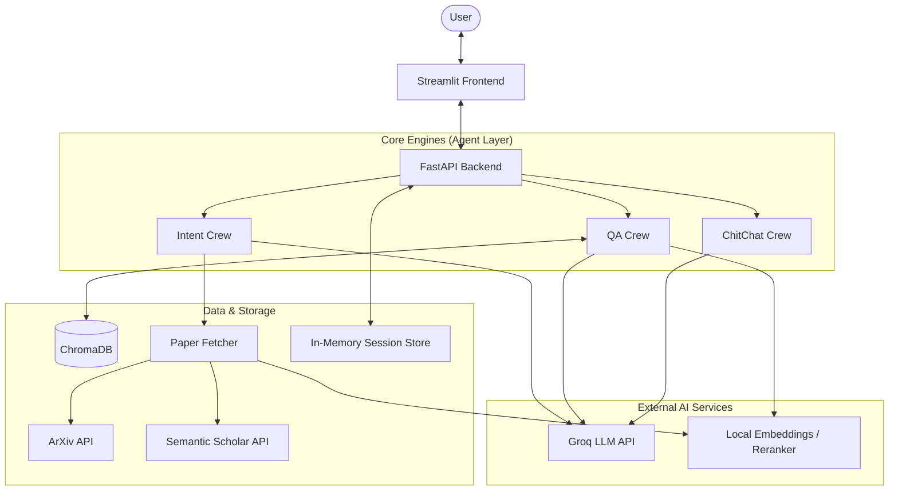

# RAG Research Agent — Project Documentation

This document is the single source of truth for the project's system design, component architecture, data flows, deployment strategy, and architectural decisions.

---

## Table of Contents

1. [Project Structure](#1-project-structure)
2. [High-Level Architecture](#2-high-level-architecture)
3. [Component Details](#3-component-details)
4. [Data Flow](#4-data-flow)
5. [Deployment & Infrastructure](#5-deployment--infrastructure)
6. [Scaling Considerations](#6-scaling-considerations)
7. [Architectural Decisions & Critical Analysis](#7-architectural-decisions--critical-analysis)
8. [Known Gaps & Future Work](#8-known-gaps--future-work)

---

## 1. Project Structure

```
rag-res-agent/
├── src/
│   ├── agents_src/
│   │   ├── agents/          # Agent definitions (intent, qa, chitchat)
│   │   ├── config/
│   │   │   └── agent_settings.py   # Centralized settings (env-backed)
│   │   ├── crew.py          # CrewAI crew definitions
│   │   ├── llm/             # LLM initialization (Groq)
│   │   ├── models.py        # Shared model singletons (embed, rerank)
│   │   ├── tasks/
│   │   │   ├── check_intent_task.py
│   │   │   ├── chitchat_task.py
│   │   │   └── qa_task.py
│   │   ├── tools/
│   │   │   └── rag_qa_tool.py      # RAG retrieval + reranking tool
│   │   └── utils/
│   │       └── paper_fetcher.py    # Two-phase paper fetch + MMR ranking
│   ├── backend_src/
│   │   ├── api/             # FastAPI route handlers
│   │   ├── memory/          # In-memory session store
│   │   ├── services/        # Chat orchestration logic
│   │   └── main.py
│   └── frontend_src/
│       └── app.py           # Streamlit UI
├── scripts/
│   └── seed_vectorstore.py  # One-time script to pre-seed vector store from local docs
├── tests/
│   └── check_crew.py        # Smoke test for QA crew
├── data/                    # Runtime data (gitignored, mounted as volume)
│   ├── docs/                # Downloaded PDFs
│   └── vector_store/        # ChromaDB persistent storage
├── docker-compose.yml
├── Dockerfile
├── start.sh
├── steps.txt
├── .env.example
├── requirements.txt
├── docs.md                  # This file
└── DISCUSSION.md            # Collaborative planning notes
```

**Key conventions:**
- `data/` is gitignored and should be bind-mounted in Docker so it persists across restarts.
- `scripts/seed_vectorstore.py` is run manually (or optionally on startup via `start.sh`) to load a static document corpus before first use.
- All tunable RAG constants live in `AgentSettings` — never hardcoded in tools/utils.

---

## 2. High-Level Architecture

The system follows a **Modular Monolith** architecture wrapped in a containerized environment. While logically separated into "Agents", "Backend Services", and "Frontend", they run within the same process/container to minimize complexity and latency for this research prototype.

### System Context Diagram



---

## 3. Component Details

### A. Frontend Layer
- **Technology**: Streamlit
- **Location**: `src/frontend_src/app.py`
- **Role**:
  - Renders the Chat UI.
  - Manages explicit `session_id` generation (UUID).
  - Displays markdown responses and source citations.
  - **Stateless**: all conversation history managed by the backend.

### B. Backend API Layer (FastAPI)
- **Technology**: FastAPI
- **Location**: `src/backend_src/api/chat.py` & `src/backend_src/services/chat.py`
- **Role**:
  - Exposes `POST /chat/answer` endpoint.
  - **Orchestrator**: Receives query → Updates Memory → calls Intent Agent → Routing Logic → calls QA/ChitChat Agent → Updates Summary → Returns Response.
- **State Management**:
  - `src/backend_src/memory/session_store.py` holds `sessions` dict in RAM.
  - Session memory is lost on process restart (not persisted to disk).

### C. Agent Layer (CrewAI)
- **Technology**: CrewAI
- **Location**: `src/agents_src/`

| Agent | Model | Temp | Role |
| :--- | :--- | :--- | :--- |
| Intent Agent | Groq Llama-3.3-70B | 0.0 | Classifies query → `{fetch, use_rag, queries, category, ...}` |
| QA Agent | Groq Llama-3.3-70B | 0.0 | Synthesizes answers from retrieved chunks via `rag_query_tool` |
| ChitChat Agent | Groq Llama-3.3-70B | 0.7 | Handles greetings and general conversation |

**Intent Agent query generation rules** (`check_intent_task.py`):
- **TITLE LOOKUP** (user asks for a specific paper by name): return the exact title as a **single query** — no expansion.
- **TOPIC SEARCH** (user asks for papers on a subject): generate **2–5 diverse queries** covering different facets.

### D. Data Ingestion & Retrieval Layer
- **Technology**: LlamaIndex, ChromaDB, PyMuPDF, HuggingFace Transformers
- **Location**: `src/agents_src/utils/paper_fetcher.py` & `src/agents_src/tools/rag_qa_tool.py`

#### Paper Fetching Pipeline (two-phase)

**Phase 1 — Title-specific search** (runs for every query):
- ArXiv `ti:` field search (title only, not full-text).
- Semantic Scholar API (`/graph/v1/paper/search`).
- Results split by title similarity (`SequenceMatcher` ratio ≥ 0.75) into:
  - **Confirmed matches** — known to be the right paper.
  - **Broad candidates** — potentially relevant.

**Phase 2 — Broad topic search** (for all queries × categories):
- ArXiv `all:` search across all configured categories.
- Results added to broad candidates pool.

**Ranking & Selection** (cross-encoder + MMR):
1. Cross-encoder (`BAAI/bge-reranker-large`) scores **all candidates** in one batch against the primary query.
2. Scores are min-max normalized to [0, 1].
3. Embeddings computed for all candidates (for MMR redundancy term).
4. **Confirmed matches** fill first slots by pure cross-encoder relevance.
5. **Remaining slots** filled by MMR from broad candidates:
   ```
   MMR score = λ × cross_encoder_score − (1−λ) × max_cosine_sim(candidate, already_selected)
   ```
   λ = 0.7 (configurable via `MMR_LAMBDA` constant).

**Download & Ingest**:
- Download PDFs (ArXiv direct or `openAccessPdf.url` from Semantic Scholar).
- Parse with PyMuPDF → chunk (512 tokens, 100 overlap) → embed → store in ChromaDB.

#### RAG Retrieval Pipeline (`rag_qa_tool.py`)
1. Vector search → top `RETRIEVAL_TOP_K` (15) chunks.
2. Cross-encoder rerank → keep top `RERANK_TOP_K` (5) chunks.
3. Synthesize answer with LlamaIndex `ResponseSynthesizer`.

#### Centralized RAG Settings (`agent_settings.py`)

| Setting | Default | Env Var | Description |
| :--- | :--- | :--- | :--- |
| `CHUNK_SIZE` | 512 | `CHUNK_SIZE` | Tokens per chunk at ingestion |
| `CHUNK_OVERLAP` | 100 | `CHUNK_OVERLAP` | Overlap between consecutive chunks |
| `RETRIEVAL_TOP_K` | 15 | `RETRIEVAL_TOP_K` | Candidate chunks from vector search |
| `RERANK_TOP_K` | 5 | `RERANK_TOP_K` | Chunks kept after cross-encoder rerank |

---

## 4. Data Flow

### Query Flow
1. **User** types "Explain the Attention mechanism."
2. **Frontend** sends `{"user_query": "...", "session_id": "xyz"}` to Backend.
3. **SessionStore** adds user message to `chat_buffer`.
4. **Backend** calls **Intent Agent** with History + Summary.
5. **Intent Agent** returns `{use_rag: true, fetch: false, queries: [...]}`.
6. **Backend** routes to **QA Crew**.
7. **QA Crew** calls `rag_query_tool("Explain Attention mechanism")`.
   - Vector search → top 15 chunks.
   - Cross-encoder rerank → top 5 chunks.
   - Generate answer with citations.
8. **Backend** appends answer to `chat_buffer`, updates `chat_summary`.
9. **Frontend** displays answer.

### Paper Fetching Flow
1. **User** types "Fetch the 'Attention is All You Need' paper."
2. **Intent Agent** returns `{fetch: true, queries: ["Attention is All You Need"], category: "cs.LG"}`.
3. **Backend** calls `fetch_papers_and_ingest`.
4. **Phase 1**: ArXiv `ti:` + Semantic Scholar search → confirmed match found.
5. **Phase 2**: Broad `all:` search for remaining candidates.
6. **Ranking**: Cross-encoder scores all; confirmed fills first slot; MMR selects from broad.
7. **Ingest**: PDFs downloaded → chunked → embedded → stored in ChromaDB.
8. **ChitChat Agent** informs user which papers were fetched (or apologizes if none found).

---

## 5. Deployment & Infrastructure

### Docker Structure
- **Base Image**: `python:3.11-slim`
- **Dependencies**: `build-essential` required for compiling vector/numpy libraries.
- **Ports**:
  - `8501`: Streamlit UI
  - `8000`: FastAPI backend

### Volume Management
Mount `./data` to persist runtime data across container restarts:

| What | Container Path | Host Path |
| :--- | :--- | :--- |
| ChromaDB vector store | `/app/data/vector_store` | `./data/vector_store` |
| Downloaded PDFs | `/app/data/docs` | `./data/docs` |

### Environment Variables

| Variable | Required | Default | Description |
| :--- | :--- | :--- | :--- |
| `GROQ_API_KEY` | Yes | — | Required for all agents |
| `MODEL_NAME` | No | `llama-3.3-70b-versatile` | Groq model to use |
| `DOCUMENTS_DIR` | No | `/app/data/docs` | PDF storage path |
| `VECTOR_STORE_DIR` | No | `/app/data/vector_store` | ChromaDB path |
| `COLLECTION_NAME` | No | `research_papers` | ChromaDB collection name |
| `CHUNK_SIZE` | No | `512` | Tokens per chunk |
| `CHUNK_OVERLAP` | No | `100` | Token overlap between chunks |
| `RETRIEVAL_TOP_K` | No | `15` | Vector search candidate count |
| `RERANK_TOP_K` | No | `5` | Chunks kept after reranking |

Copy `.env.example` to `.env` and fill in `GROQ_API_KEY` at minimum.

### Running with Docker Compose (recommended)

```bash
cp .env.example .env
# edit .env and set GROQ_API_KEY

docker compose up --build

# Stop
docker compose down
```

### Running with Docker directly

```bash
# Build
docker build -t rag-res-agent:latest .

# Run (foreground)
docker run -p 8000:8000 -p 8501:8501 \
  -v $(pwd)/data:/app/data \
  -e GROQ_API_KEY="your_key_here" \
  rag-res-agent:latest

# Run (detached)
docker run -d -p 8000:8000 -p 8501:8501 \
  -v $(pwd)/data:/app/data \
  -e GROQ_API_KEY="your_key_here" \
  --name rag-res-agent \
  rag-res-agent:latest

# Stop / restart / remove
docker stop rag-res-agent
docker start rag-res-agent
docker rm rag-res-agent
docker rmi rag-res-agent:latest
```

### Managed vs. Self-Hosted Services

| Component | Managed Service | Self-Hosted |
| :--- | :--- | :--- |
| LLM Inference | **Groq API** (Cloud) | — |
| Embeddings | — | **HuggingFace** (Local) |
| Vector DB | — | **ChromaDB** (Local file-based) |
| Reranking | — | **BAAI/bge-reranker-large** (Local) |
| Frontend/API | — | **Streamlit/FastAPI** (Local) |

---

## 6. Scaling Considerations

- **Concurrency**: `PersistentClient` ChromaDB is **not thread-safe for concurrent writes**. Multiple users triggering paper ingestion simultaneously may corrupt the DB. Fix: run Chroma as a separate Docker service in client-server mode.
- **Memory**: Cross-Encoder + Embedding models load into RAM (~2–4 GB depending on hardware).
- **Statelessness**: `SessionStore` is in-memory. Scaling to 2+ containers requires Redis for shared session state.
- **Ingestion blocking**: PDF download + embedding is synchronous and blocks the request. For production, offload to a background worker (Celery / asyncio task).

---

## 7. Architectural Decisions & Critical Analysis

### 7.1 LLM Selection

**Current**: Groq (llama-3.3-70B-versatile)

**Rationale**: Latency optimization. In an agentic loop (Intent → Router → Tool → Response), latency compounds. Groq's LPU architecture minimizes per-step delay.

**Risk Factors**:
1. Rate limits more restrictive than OpenAI.
2. Context window may constrain full paper analysis.
3. Strict JSON schema output occasionally needs retry logic.

**Alternatives**:
- ✅ **Hybrid Router/Analyzer**: Small/fast model (e.g., Llama-3-8B) for Intent classification; larger model (GPT-4o or Claude) for QA synthesis. Lower cost, better synthesis quality. Requires multiple API keys.
- ❌ **Pure Local 8B models**: Insufficient instruction-following for reliable JSON schema output in Intent Agent.

---

### 7.2 Agent Architecture

**Current**: CrewAI (Router Pattern)

**Analysis**: CrewAI's role-playing abstraction compartmentalizes prompts well, but adds sequential overhead — treating agents as distinct "thinking" entities adds latency even for simple classification tasks.

**Alternatives**:
- ✅ **Functional Router**: Replace Intent Crew with a raw `client.chat.completions.create` call enforcing a JSON schema. Cuts ~500ms–1s per interaction. Less extensible if intent logic grows complex.
- ✅ **LangGraph for Cyclic Flows**: Enables "Deep Research" loops (`Plan → Fetch → Read → Realize it needs more → Fetch Again`). State transitions are explicit and debuggable.

---

### 7.3 RAG Strategy

**Current**: Agentic RAG (Intent-Driven, Conditional Retrieval)

**Analysis**: Relies entirely on the Intent Agent to decide *when* to retrieve. The flaw: "Unknown Unknowns" — e.g., "What did we discuss about the third paper?" may be misclassified as chitchat by a rigid intent classifier.

**Alternatives**:
- ✅ **Speculative RAG**: Run retriever *in parallel* with Intent classification. If Intent says no RAG, discard. Zero latency penalty; ~50% wasted compute on non-RAG queries.
- ❌ **Keyword-Only Triggering**: Too brittle. Fails on implicit references.

---

### 7.4 Embedding Model

**Current**: HuggingFace Embeddings (Local Singleton)

**Analysis**: Good for privacy and cost. Blocks the main thread during large PDF ingestion on CPU-only containers.

**Alternatives**:
- ✅ **Async Ingestion Worker**: Offload embedding to a separate process/service. Chat remains responsive. Adds deployment complexity.
- ✅ **OpenAI `text-embedding-3-small`**: Fast and cheap. Vendor lock-in; switching models requires full re-indexing.

---

### 7.5 Vector Store

**Current**: ChromaDB (Persistent Local, file-based)

**Analysis**: Effectively SQLite — intended for single-user local sessions. Not thread-safe for concurrent writes.

**Alternatives**:
- ✅ **Client-Server Chroma (Dockerized)**: Run Chroma as a separate service. Handles concurrency; decouples storage from app logic.
- ❌ **In-Memory Only**: Knowledge base lost on restart.

---

### 7.6 Paper Fetching & Ranking

**Current**: Two-phase fetch (title search + broad search) → Cross-encoder ranking → MMR diversity selection

**Why two-phase**: ArXiv `all:` search is too broad for specific paper lookups. Using `ti:` (title field) for confirmed matches dramatically improves precision for requests like "Fetch the Attention is All You Need paper."

**Why Semantic Scholar**: Provides an independent index with direct open-access PDF links, catching papers that ArXiv's title search may miss or rank poorly.

**Why cross-encoder over bi-encoder for ranking**: Cross-encoders jointly attend over the (query, document) pair rather than independently encoding each — significantly better at capturing query-document relevance. More compute-intensive but applied to a small candidate set (no runtime cost issue).

**Why MMR for diversity**: Among broad candidates, papers can be highly relevant but cover the same narrow aspect. MMR (`λ=0.7`) penalizes candidates too similar to already-selected papers, ensuring broader topic coverage.

**Alternatives**:
- ✅ **Cross-encoder on abstracts pre-download**: Apply cross-encoder to abstract text during initial search to avoid downloading low-relevance PDFs. Reduces bandwidth/storage.
- ✅ **Full-text "flash" scan before full ingestion**: Download all candidates, run cheap keyword scan, then decide which to fully embed. Higher recall, slower pipeline.

---

### 7.7 Memory & Summarization

**Current**: Rolling Summary + Sliding Window (last 5 turns)

**Analysis**: Lossy compression. Every summarization pass loses nuance. After 10 turns, details like "the user disagreed with the second paper's methodology" may be smoothed away.

**Alternatives**:
- ✅ **Structured Knowledge Graph**: Extract entities (`User_Interest: [RAG, Transformers]`, `Papers_Discussed: [...]`). Perfect recall for specific facts. Requires a fixed schema.
- ✅ **Vectorized Memory**: Embed every turn; retrieve "relevant past thoughts" alongside document chunks. Adds a second retrieval pool to balance.

---

### 7.8 Deployment

**Current**: Monolithic Docker Container (docker-compose with two services from the same image)

**Analysis**: Both frontend and backend run from the same image for simplicity. Horizontal scaling is not possible because ChromaDB and session state are local to each container.

**Alternatives**:
- ✅ **Decomposed Architecture**: Separate containers for Frontend, Backend API, ChromaDB (server mode), and Redis. Enables independent scaling of the stateless API. Risk: added operational complexity for a prototype.
- ❌ **Serverless (AWS Lambda)**: Loading HuggingFace models takes seconds on cold start — unworkable. Models must be resident in memory.

---

## 8. Known Gaps & Future Work

These gaps are tracked in `DISCUSSION.md` with concrete implementation suggestions.

### Conversational RAG

| Gap | Impact | Suggested Fix |
| :--- | :--- | :--- |
| `rag_query_tool` synthesizes without conversation context | Responses ignore prior discussion | Pass `chat_summary` into `ResponseSynthesizer` prompt |
| No standalone query rewriting | Follow-up questions ("Tell me more about that") fail retrieval | Rewrite query using chat history before vector search |
| No chunk deduplication across turns | Same chunks re-retrieved on follow-ups, repetitive answers | Track `retrieved_chunk_ids` in session; penalize or skip seen chunks |
| Session-scoped vector store | All users share one global ChromaDB collection | Namespace by `session_id` in collection metadata |
| No structured research memory | Agent forgets "User disliked paper X" after summarization | Extract structured notes from each turn, store alongside summary |
