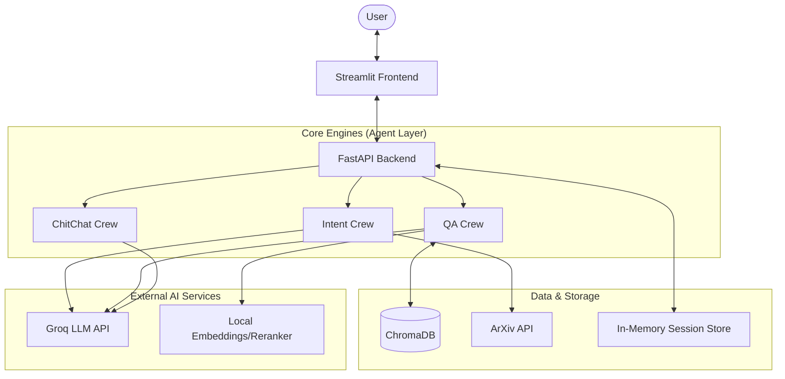

# RAG Research Agent — Project Documentation

This document is the single source of truth for the project's system design, component architecture, data flows, deployment strategy, and architectural decisions.

---

## Table of Contents

1. [High-Level Architecture](#1-high-level-architecture)
2. [Component Details](#2-component-details)
3. [Data Flow](#3-data-flow)
4. [Deployment & Infrastructure](#4-deployment--infrastructure)
5. [Scaling Considerations](#5-scaling-considerations)
6. [Architectural Decisions & Critical Analysis](#6-architectural-decisions--critical-analysis)

---

## 1. High-Level Architecture

The system follows a **Modular Monolith** architecture wrapped in a containerized environment. While logically separated into "Agents", "Backend Services", and "Frontend", physically they run within the same process/container to minimize complexity and latency for this research prototype.

### System Context Diagram



---

## 2. Component Details

### A. Frontend Layer
- **Technology**: Streamlit / Python
- **Location**: `src/frontend_src/app.py`
- **Role**:
  - Renders the Chat UI.
  - Manages explicit `session_id` generation (UUID).
  - Displays markdown responses and source citations.
  - **Stateless**: expects the backend to manage conversation history.

### B. Backend API Layer (FastAPI)
- **Technology**: FastAPI
- **Location**: `src/backend_src/api/chat.py` & `src/backend_src/services/chat.py`
- **Role**:
  - Exposes `POST /chat` endpoint (or internal function `get_answer`).
  - **Orchestrator**: Receives query → Updates Memory → calls Intent Agent → Routing Logic → calls QA/ChitChat Agent → Updates Summary → Returns Response.
- **State Management**:
  - Uses `src/backend_src/memory/session_store.py` to hold `sessions` dictionary in RAM.
  - **Critical Note**: If the application restarts, all active session memory is lost (not currently persisted to disk).

### C. Agent Layer (CrewAI)
- **Technology**: CrewAI, LangChain/LlamaIndex primitives
- **Location**: `src/agents_src/`
- **Components**:
  1. **Intent Agent**
     - **Model**: Groq (Llama-3.3-70B, temp=0.0)
     - **Task**: Router — classifies input as `fetch`, `use_rag`, or `chitchat`.
     - **Input**: User query + Conversation Summary + Last 5 turns.
     - **Output**: JSON struct `{fetch: bool, use_rag: bool, queries: [], ...}`.
  2. **QA Agent (Researcher)**
     - **Model**: Groq (Llama-3.3-70B, temp=0.0)
     - **Tools**: `rag_query_tool`
     - **Role**: Synthesizes answers from retrieved chunks.
  3. **ChitChat Agent**
     - **Model**: Groq (Llama-3.3-70B, temp=0.7)
     - **Role**: Handles greetings and general conversation without RAG.

### D. Data Ingestion & Retrieval Layer
- **Technology**: LlamaIndex, ChromaDB, PyMuPDF
- **Location**: `src/agents_src/utils/paper_fetcher.py` & `rag_qa_tool.py`
- **Pipeline**:
  1. **Fetch**: Queries ArXiv API based on Intent output.
  2. **Filter**: Deduplicates papers using title similarity.
  3. **Ingest**: Downloads PDF → Extracts Text → Chunking (1024 tokens) → Embedding (HuggingFace) → Store in ChromaDB.
  4. **Retrieve**: Vector Search (Top-10) → Cross-Encoder Reranking (Top-3) → Synthesis.

---

## 3. Data Flow

### Query Flow
1. **User** types "Explain Attention mechanism".
2. **Frontend** sends `{"user_query": "...", "session_id": "xyz"}` to Backend.
3. **SessionStore** adds user message to `chat_buffer`.
4. **Backend** calls **Intent Agent** with History + Summary.
5. **Intent Agent** returns `{use_rag: True, request: "Explain Attention"}`.
6. **Backend** sees `use_rag=True`, chooses **QA Crew**.
7. **QA Crew** calls `rag_query_tool("Explain Attention")`.
   - Retrieves relevant chunks from Chroma.
   - Reranks chunks.
   - Generates answer with citations.
8. **Backend** receives answer, adds to `chat_buffer`.
9. **Backend** triggers **Memory Assistant** (async/sync) to update `chat_summary`.
10. **Frontend** displays answer.

### Paper Fetching Flow
1. **User** types "Find papers on FlashAttention".
2. **Intent Agent** returns `{fetch: True, queries: ["FlashAttention"], ...}`.
3. **Backend** calls `fetch_papers_and_ingest`.
4. **System** searches ArXiv → Downloads PDFs → Embeds to Chroma → Returns success message.
5. **Backend** proceeds to QA Flow (optional) or informs user "Papers acquired."

---

## 4. Deployment & Infrastructure

The system is designed to be deployed as a single **Docker Container**.

### Docker Structure
- **Base Image**: `python:3.11-slim`
- **Dependencies**: `build-essential` required for compiling vector/numpy libraries.
- **Ports**:
  - `8501`: Streamlit UI (public facing)
  - `8000`: FastAPI (internal or public API)

### Volume Management
Mount volumes to persist data across container restarts:

| Volume | Container Path | Host Path |
| :--- | :--- | :--- |
| Vector Store (ChromaDB) | `/app/doc_vector_store` | `./data/chroma_db` |
| Downloaded PDFs (debug) | `/app/docs_dir` | `./data/docs` |

### Environment Variables
| Variable | Required | Description |
| :--- | :--- | :--- |
| `GROQ_API_KEY` | Yes | Required for all Agents |
| `MODEL_NAME` | No | Defaults to `llama-3.3-70b-versatile` |
| `VECTOR_STORE_DIR` | No | Internal path for ChromaDB |

### Managed vs. Self-Hosted Services
| Component | Managed Service | Self-Hosted |
| :--- | :--- | :--- |
| LLM Inference | **Groq API** (Cloud) | — |
| Embeddings | — | **HuggingFace** (Local, CPU/GPU) |
| Vector DB | — | **ChromaDB** (Local File-based) |
| Reranking | — | **Cross-Encoder** (Local) |
| Frontend/API | — | **Streamlit/FastAPI** (Local) |

### Running with Docker Compose (recommended)

```bash
# Copy and fill in your API key
cp .env.example .env

# Build and start both services
docker compose up --build

# Stop
docker compose down
```

### Running with Docker directly

```bash
# Build
docker build -t rag-res-agent:latest .

# Run (foreground)
docker run -p 8000:8000 -p 8501:8501 \
  -v $(pwd)/data:/app/data \
  -e GROQ_API_KEY="your_key_here" \
  rag-res-agent:latest

# Run (detached)
docker run -d -p 8000:8000 -p 8501:8501 \
  -v $(pwd)/data:/app/data \
  -e GROQ_API_KEY="your_key_here" \
  --name rag-res-agent \
  rag-res-agent:latest

# Stop / restart / remove
docker stop rag-res-agent
docker start rag-res-agent
docker rm rag-res-agent
docker rmi rag-res-agent:latest
```

---

## 5. Scaling Considerations

- **Concurrency**: `PersistentClient` in ChromaDB is **not thread-safe for concurrent writes**. Multiple users triggering paper ingestion simultaneously may corrupt or lock the DB.
  - *Fix*: Move to client-server Chroma deployment.
- **Memory**: Cross-Encoder and Embedding models are loaded into RAM. Expect ~2–4 GB container memory usage depending on model size.
- **Statelessness**: `SessionStore` is currently in-memory. Scaling to 2+ containers requires moving session state to **Redis**.

---

## 6. Architectural Decisions & Critical Analysis

This section captures the key architectural decisions, their trade-offs, biases, and viable alternatives for production scaling.

---

### 6.1 LLM Selection

**Current Decision**: Groq (llama-3.3-70B-versatile)

**Options Considered**
- **Ollama (llama-3.1-8B)**: Local execution.
- **OpenAI GPT-4o / Claude 3.5 Sonnet**: High-end hosted models.
- **Groq**: Selected for speed/quality balance.

**Analysis**
The choice of Groq is biased towards **latency optimization**. In an agentic loop (Intent → Router → Tool → Response), latency compounds — a 2s delay per step results in an 8–10s user-side wait. Groq's LPU architecture solves this.

**Risk Factors**:
1. **Rate Limits**: Groq's tiers can be restrictive vs. OpenAI.
2. **Context Window**: Production RAG often demands 128k+ tokens for full paper analysis.
3. **Instruction Following**: Occasionally requires retry logic for strict JSON schemas.

**Alternatives**
- ✅ **Hybrid Approach (Router = Small/Fast, Analyzer = Smartest)**: Use a smaller model (e.g., Llama-3-8B) for the Intent Agent (classification only) and GPT-4o or Claude for the QA Agent (complex synthesis). Reduces cost; improves quality on research summaries. Downside: multiple API keys/providers.
- ❌ **Pure Local 8B/7B Models**: Insufficient for reliable one-shot reasoning in the Router pattern. High misclassification rates and malformed JSON outputs.

---

### 6.2 Agent Architecture

**Current Decision**: CrewAI (Router Pattern)

**Options Considered**
- **Single Chain**: Linear execution.
- **LangGraph**: Cyclic graph based.
- **CrewAI**: Task-based orchestration. Selected.

**Analysis**
CrewAI's "Role-Playing" abstraction compartmentalizes prompts well, but enforces **sequential overhead** — treating agents as distinct entities that must "think" before acting adds latency even for trivial tasks. Using a full Crew for a simple boolean `fetch` check is non-trivial overhead.

**Alternatives**
- ✅ **Functional Router (Code-based or Simple LLM Call)**: Replace the Intent Crew with a raw `client.chat.completions.create` call enforcing a JSON schema, or keyword heuristics for obvious cases. Cuts 500ms–1s per interaction. Less extensible if intent logic grows complex.
- ✅ **LangGraph for Cyclic Flows**: Enables "Deep Research" where the agent loops (`Plan → Fetch → Read → Realize it needs more → Fetch Again`). State transitions are explicit and easier to debug.

---

### 6.3 RAG Strategy

**Current Decision**: Agentic RAG (Intent-Driven, Conditional Retrieval)

**Options Considered**
- **Standard RAG**: Always retrieve.
- **Agentic RAG**: Conditional retrieval. Selected.

**Analysis**
The system relies entirely on the Intent Agent to decide *when* to retrieve. **The Flaw**: "Unknown Unknowns" — if a user asks something that *sounds* like chitchat but requires context (e.g., "What did we discuss about the third paper?"), a rigid intent classifier may miss it. We implicitly assume users strictly separate "chatting" from "working".

**Alternatives**
- ✅ **Speculative RAG (Parallelization)**: Run the RAG retriever *in parallel* with Intent classification. If Intent says "No RAG", discard the results. Zero latency penalty; 50% wasted compute on non-RAG queries.
- ❌ **Keyword-Only Triggering**: Too brittle. Fails on implicit references like "Tell me more about that contradiction".

---

### 6.4 Embedding Model

**Current Decision**: HuggingFace Embeddings (Local, Shared Singleton)

**Options Considered**
- **OpenAI Embeddings**: API-based.
- **Local HuggingFace**: Selected.

**Analysis**
Local embeddings are great for privacy and cost, but `HuggingFaceEmbedding` defaults can be slow on CPU-only containers and block the main thread during large PDF ingestion, making the UI feel unresponsive.

**Alternatives**
- ✅ **Asynchronous Ingestion Service**: Offload embedding generation to a separate worker process or microservice (e.g., a dedicated TEI container). Chat remains responsive while the agent reads in the background. Adds deployment complexity (Redis/Celery or separate containers).
- ✅ **OpenAI `text-embedding-3-small`**: Extremely cheap, fast, widely supported (1536 dimensions). Downside: vendor lock-in; switching later effectively requires re-indexing everything.

---

### 6.5 Vector Store

**Current Decision**: ChromaDB (Persistent Local)

**Analysis**
Chroma in `PersistentClient` ("files") mode is effectively SQLite — intended for single-user local sessions. It is **not thread-safe for concurrent writes**. Deploying for two simultaneous users would cause one to block the other.

**Alternatives**
- ✅ **Client-Server Mode (Dockerized Chroma)**: Run Chroma as a separate service in `docker-compose`. Handles concurrency better; decouples storage from application logic. One more container to manage.
- ❌ **In-Memory Only**: Users lose their entire knowledge base on container restart.

---

### 6.6 Paper Fetching & Ranking

**Current Decision**: Fetch → Deduplicate → Rank by Similarity → Ingest Top-3

**Analysis**
This pipeline prioritizes **bandwidth** over **recall**. Filtering by title/abstract similarity *before* downloading PDFs may discard papers with vague abstracts but highly relevant content deep in the text. **Biased Assumption**: "Abstracts accurately represent paper content" (often false in academia).

**Alternatives**
- ✅ **Full-Text "Flash" Ingestion**: Download Top-10 PDFs, convert to text, run a fast keyword or cheap-model scan before embedding. Significantly higher recall for specific facts. High bandwidth/compute; slower time-to-first-token.
- ✅ **Cross-Encoder for Pre-Ranking**: Apply the Cross-Encoder on *abstracts* during the initial search phase (not just on chunks post-ingestion) for better PDF selection before download.

---

### 6.7 Memory & Summarization

**Current Decision**: Rolling Summary + Sliding Window

**Analysis**
This is a "Lossy Compression" algorithm. Every summarization pass loses detail. After 10 turns, the nuance of "Why I disliked the second paper" may be smoothed into "User discussed papers." We prioritize token savings over perfect recall.

**Alternatives**
- ✅ **Structured Knowledge Graph (Entity Extraction)**: Extract entities: `User_Interest: [Transformers, RAG]`, `Papers_Read: [Attention is All You Need]`. Perfect recall of specific facts. Hard to implement without a fixed schema.
- ✅ **Vectorized Memory (store turns in Chroma)**: Embed every user interaction; retrieve "relevant past thoughts" alongside document chunks. Infinite effective memory window. Adds complexity — two retrieval pools (Docs vs. Memory) to balance and rerank.

---

### 6.8 Deployment

**Current Decision**: Monolithic Docker Container

**Analysis**
The current setup bundles the App, Vector DB files, and downloaded PDFs into one image/volume. **Horizontal scaling is impossible** — spinning up 2 instances would create fragmented, divergent memory files.

**Alternatives**
- ✅ **Decomposed Architecture**: 1 Container each for Frontend, Backend API, Vector DB, and Redis (caching). Allows independent scaling of the stateless Backend API. Risk: "Microservices Hell" for a simple prototype.
- ❌ **Serverless Functions (AWS Lambda)**: Loading HuggingFace Embedding/CrossEncoder models takes seconds per cold start — unworkable. Models need to be resident in memory.
